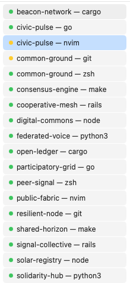

# iterm2-status-bar

A lightweight macOS status bar app that puts a persistent sidebar on every monitor,
showing all open iTerm2 windows — filtered to the windows on each screen.



## Features

- One sidebar per connected display, anchored to the right edge
- Shows only the iTerm2 windows on that screen
- Click any entry to raise and focus that window
- Yellow dot = session is running a command; green dot = waiting at prompt
- Refreshes every 1s when iTerm2 is active, every 10s in the background
- Black circle menu bar icon — click to hide/show or quit
- No Dock icon

## Requirements

- macOS 13+ (tested on macOS 26.5)
- iTerm2

## Install

```bash
git clone https://github.com/yourusername/iterm2-status-bar
cd iterm2-status-bar
bash build-app.sh
```

This compiles the app and opens it. On first launch:

1. Grant **Accessibility** access when prompted
   (System Settings → Privacy & Security → Accessibility → iTermSidebar)
2. Grant **Automation** access to control iTerm2
   (System Settings → Privacy & Security → Automation → iTermSidebar → iTerm2)

## Install to /Applications

```bash
rm -rf /Applications/iTermSidebar.app
cp -r iTermSidebar.app /Applications/iTermSidebar.app
open /Applications/iTermSidebar.app
```

## Auto-start on login

Add `/Applications/iTermSidebar.app` to System Settings → General → Login Items.

## Usage

| Action | Result |
|--------|--------|
| Click a window name | Raises that iTerm2 window |
| Click menu bar icon | Shows Hide/Show Sidebar and Quit |
| Yellow dot | Session is running a process |
| Green dot | Session is at a shell prompt |

## How it works

The app uses AppleScript to query iTerm2 every few seconds:
- Window titles, positions, and session processing state
- Maps each window to a screen by comparing its position to `NSScreen.frames`
- Raises windows via `select window N` AppleScript

No network access. No data collection. Runs entirely locally.

## Build from source

Requirements: Xcode Command Line Tools (`xcode-select --install`)

```bash
bash build-app.sh
```

The script compiles `main.swift` with `swiftc`, assembles `iTermSidebar.app`,
and launches it via `open`.

## License

MIT
